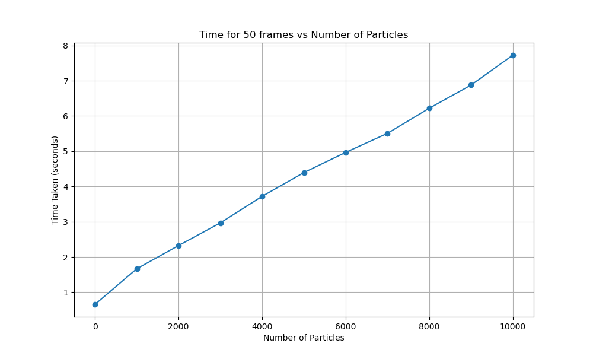

# N Body Simulator
To create a program that simulates gravitation interaction between bodies
## Objectives
- Accuracy: Simulation has to be accurate. Cross check with other algorithms and in simpler test cases
- Edge cases: Handle collisions and edge cases that may arise from this.
- Efficiency: Use Barnes-Hut algorithm to reach O(n log n) efficiency. Run random test cases to see if this is
reached
- Parallel Processing: Use OpenMP and other parallelization libraries to improve speed (aim is to improve speed
by 20% atleast). Benchmark and compare
- Graphical Represation: Display the bodies using graphics libraries to visualize motion
- Scalability: Run it on large test cases (100+ bodies)

